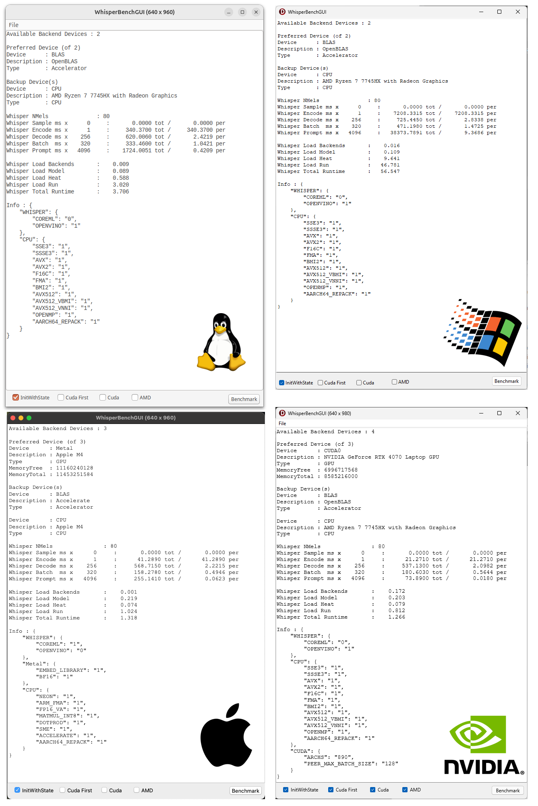

Pascal (Delphi, FPC = TODO) binding for [whisper.cpp](https://github.com/ggml-org/whisper.cpp).

Whisper.cpp itself builds on [ggml](https://github.com/ggml-org/ggml), a C/C++ Tensor library for ML.

The libraries utilize OpenAI's Whisper AI general-purpose speech recognition models to achieve performant speech to text (transcription) even allowing for a level of foreign language translation.

Whisper.cpp features many optional backends to perform the AI computations. These backends range from the humble CPU thru Vulkan GPU and culminate with CUDA support for the non-Apple platforms while Apple Silicon can leverage both Metal and CoreML to accelerate processing.

The whole eco-system, including these bindings, are all multi-platform.

For Delphi FMX can target Windows, Mac, Linux (suitable version of Delphi required), Android and iOS. VCL is supported but there is no real benefit to choosing it unless you're lost when it comes to FMX.

The [TODO] FLC/Lazarus version will allow for an even wider range of platforms (even the Raspberry Pi)

Detailed Readme.MD is high on my TODO list (but behind other documentation)

Link for self - [whisper fork](https://github.com/WhisperBooks/whisper.cpp)

CPU Only for top images - AMD 7745HX
Bottom Left - Mac M4 basic
Bottom Right - NVIDIA 4070 Laptop GPU

